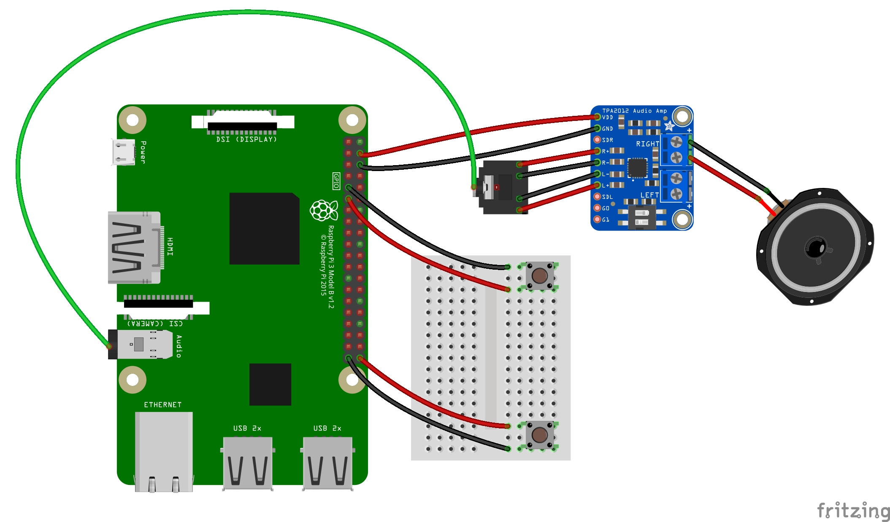

# PiAudioButton
A simple program that loops an audio track and selects another audio track randomly from a list when a button is pressed. We have a second button attached, that when held for 4 seconds will shutdown the Raspberry safely.

The audio is being amplified using an Adafruit TPA2012 2.1W Stereo Audio Amplifier: https://www.adafruit.com/product/1552 This is being powered from the Raspberry Pi's 5V GPIO pin.

To install either clone this repo to a Raspberry Pi with wifi setup on it, install the dependancies and set the "PiAudioButtonMain.py" to autorun at start up, or run this command:

    curl -L http://bit.ly/PiAudioButton | sudo bash

N.B. It is generally not a good idea to pipe the output of a shortened URL straight into a root shell; but follow the link first and you will see it takes you to the setup.sh file and processes that for you!

The audio files included here come from http://www.wavsource.com Replace them with your own. I found that PyGame prefers 16bit WAV files YMMV.

